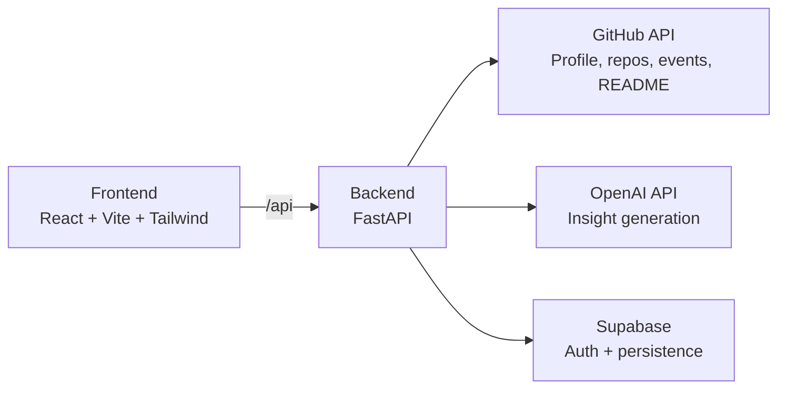

# GitIQ

Turn an average GitHub profile into a stronger professional signal.

[](#tech-stack)
[](#tech-stack)
[](#tech-stack)
[](#tech-stack)

## The Idea

Many developers get rejected not because they lack skill, but because their GitHub profile does not showcase that skill clearly.

GitIQ analyzes your profile and repositories, points out what is weak, and tells you exactly how to improve it.

## Elevator Pitch

GitIQ is an AI-powered GitHub profile coach. It converts profile and repository data into actionable feedback so developers can present themselves better and improve hiring outcomes.

## What It Does

| Area                | What GitIQ Provides                                                                |
| ------------------- | ---------------------------------------------------------------------------------- |
| Profile Analysis    | Scores and insights for profile quality, activity, consistency, and showcase value |
| Repo-Level Insights | Deep repository analysis with README-aware feedback                                |
| Faster Experience   | Cached analysis for quick dashboard reloads                                        |
| Guidance            | Actionable improvements, not just raw stats                                        |

## Architecture



## Key User Flow

1. User signs in with GitHub via Supabase auth.
2. Frontend requests profile analysis from backend.
3. Backend fetches profile and repository data from GitHub.
4. Backend generates insights and stores analysis in Supabase.
5. Frontend renders scores, summaries, and repo-level recommendations.

## Tech Stack

- Frontend: React, Vite, TailwindCSS, Axios, Supabase JS
- Backend: FastAPI, Uvicorn, HTTPX, OpenAI SDK, Supabase Python SDK
- Data Layer: Supabase

## Project Structure

```text
GitIQ/
├─ backend/
│  ├─ app/
│  │  ├─ routers/           # API routes (analysis, auth, health)
│  │  └─ services/          # GitHub fetch, scoring, AI insights, Supabase ops
│  ├─ models/               # request/response schemas
│  ├─ db.py                 # Supabase client setup
│  └─ main.py               # FastAPI app entry point
└─ frontend/
   ├─ src/components/       # dashboard and analysis UI components
   ├─ src/lib/supabase.js   # frontend Supabase client
   └─ src/api.js            # Axios API client
```

## API Highlights

- `GET /` health check
- `POST /auth/github-login` sync authenticated GitHub user profile
- `GET /analyze/{username}` generate fresh analysis
- `GET /analyze/{username}/cached` return latest cached analysis
- `GET /repo-analyses/{username}` paginated repository analysis list
- `GET /repo-analyses/{username}/item` fetch one repository analysis
- `POST /repo-analyses/{username}/insights` generate or refresh repo LLM insights

## Planned Features

- Chat with your profile: ask questions and get targeted improvement guidance.
- One-click README generation:
  - GitHub profile README
  - Individual repository README

## Quick Start

### Backend

```bash
cd backend
python -m venv .venv
.venv\Scripts\activate
pip install -e .
python main.py
```

Backend environment variables:

- `SUPABASE_URL`
- `SUPABASE_SERVICE_ROLE_KEY` or `SUPABASE_KEY`
- `OPENAI_API_KEY`
- `GITHUB_TOKEN`

### Frontend

```bash
cd frontend
npm install
npm run dev
```

Frontend environment variables:

- `VITE_SUPABASE_URL`
- `VITE_SUPABASE_ANON_KEY`

Frontend: `http://127.0.0.1:5173`  
Backend: `http://localhost:8000`

## Deployment

### Production Deployment Architecture

```text
Vercel/Netlify (Frontend)
  |
  | HTTPS API calls
  v
Render/Railway/Fly.io (FastAPI Backend)
  |
  +--> Supabase (DB + Auth)
  +--> GitHub API
  +--> OpenAI API
```

### Deployment Checklist

1. Deploy backend service (FastAPI) and expose a public HTTPS URL.
2. Set backend env vars: `SUPABASE_URL`, `SUPABASE_SERVICE_ROLE_KEY` (or `SUPABASE_KEY`), `OPENAI_API_KEY`, `GITHUB_TOKEN`.
3. Update frontend API base URL or proxy strategy for production.
4. Deploy frontend service and set `VITE_SUPABASE_URL`, `VITE_SUPABASE_ANON_KEY`.
5. Update backend CORS allowlist in `backend/main.py` to include deployed frontend domain.
6. Verify auth login, profile analysis, and repo insights end-to-end.

### Suggested Hosting Split

- Frontend: Vercel or Netlify
- Backend: Render or Railway
- Database/Auth: Supabase

## Why GitIQ Matters

GitIQ focuses on one practical outcome: helping developers present their work better and reduce rejections caused by poor profile presentation.
